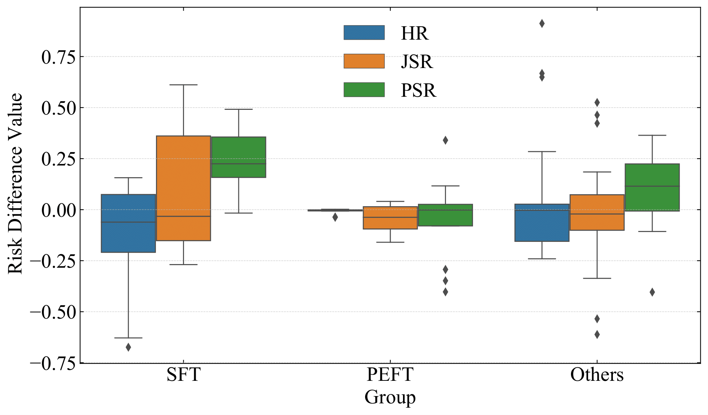
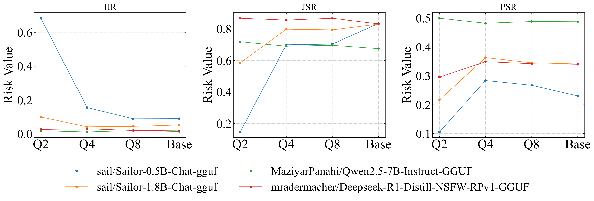
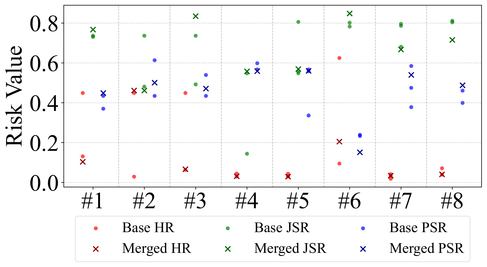

# A First Look at Model Supply Chain: From the Risk Perspective
---
## RQ1: Usage Analysis

### 1.1 Dependency Relation Analysis

#### a. Distribution and Downloads of Models

|                |    $M_b$    |    $M_d$    |    $M_r$    |    $M_i$     |     $M$     |
|:--------------:|:---------:|:---------:|:---------:|:----------:|:---------:|
| **Size**       |  49,648   | 540,838   | 566,022   | 1,251,376  | 1,817,398 |
| **Downloads**  |1,412,664,976|268,887,576|1,475,955,546|249,757,419|1,725,712,965|

#### b. Distribution of Derived Models

| Model | Count      | Percentage |
|:--------------:|:--------------:|:--------------:|
| $M_f$| 427,475    | 79.0%      |
| $M_q$ | 100,564    | 18.6%      |
| $M_m$ | 12,799     | 2.4%       |
| $M_d$ | 540,838    | 100%       |

#### c. Detailed Distribution of Model Tasks by Dependency Types

| **Relation** | **NLP**            | **CV**           | **Audio**        |**Multimodal**        |**Reinforcement Learning**        |**Tabular**        | **Total** |
|:--------------:|:--------------------:|:------------------:|------------------:|:------------------:|:------------------:|:------------------:|:-----------:|
| Fine-Tune    | **109,591** (57.8%) | 63,721 (33.6%)   | 12,804 (6.8%)    | 3,208 (1.7%)    |104 (0.1%)    |23 (0.0%)    |189,451   |
| Merge        | **11,092** (94.0%)  | 551 (4.7%)       | 7 (0.1%)     | 152 (1.3%)    |1 (0.0%)    |0 (0.0%)    |11,803    |
| Quantize     | **31,855** (93.3%)  | 687 (2.0%)       | 348 (1.0%)     |1,209 (3.5%)    |53 (0.2%)    |5 (0.0%)    | 34,157    |

#### d. Top-10 Models by In-Degree and Out-Degree
| **In-Degree** Model                                | Task             | $deg_{in}(m)$ | **Out-Degree** Model                              | Task             | $deg_{out}(m)$ |
|:-----------:|:-----------:|:-----------:|:-----------:|:-----------:|:-----------:|
| Novaciano/BAHAMUTH-PURGED-3.2-1B                    | text-generation  | 65                       | Qwen/Qwen1.5-0.5B                                 | text-generation  | 32,497                    |
| Novaciano/BAHAMUTH-PURGED-3.2-1B-Q6_K-GGUF          | --               | 65                       | black-forest-labs/FLUX.1-dev                      | text-to-image    | 32,173                    |
| QuantFactory/Loki-v2.6-8b-1024k-GGUF               | --               | 57                       | Qwen/Qwen1.5-1.8B                                 | text-generation  | 30,580                    |
| PJMixers-Archive/LLaMa-3-CursedStock-v1.6-8B        | text-generation  | 52                       | google/gemma-2b                                   | text-generation  | 23,792                    |
| PJMixers-Archive/LLaMa-3-CursedStock-v2.0-8B        | text-generation  | 47                       | google/gemma-7b                                   | text-generation  | 9,569                     |
| QuantFactory/L3-Deluxe-Scrambled-Eggs-On-Toast      | text-generation  | 36                       | distilbert/distilbert-base-uncased                | fill-mask        | 9,205                     |
| Casual-Autopsy/L3-Deluxe-Scrambled-Eggs-On-Toast    | text-generation  | 36                       | stabilityai/stable-diffusion-xl-base-1.0          | text-to-image    | 8,266                     |
| PJMixers-Archive/LLaMa-3-CursedStock-v1.8-8B        | text-generation  | 34                       | Qwen/Qwen1.5-7B                                   | text-generation  | 6,450                     |
| SanXM1/Driftwood-12B                               | text-generation  | 25                       | google-bert/bert-base-uncased                     | fill-mask        | 5,483                     |
| mergekit-community/L3.1-Athena-l-8B                 | text-generation  | 25                       | aubmindlab/bert-base-arabertv02                   | fill-mask        | 3,997                     |

### 💡 Insight

> Our analysis uncovers a comprehensive usage dependency in model supply chain.  Base models are deriving mainly through fine-tuning for NLP tasks, which speeds up progress but makes it hard to trace and trust the final model artifact because risks can flow from the base model, the tuning code, and the training data, generating a wide attack surface.  
> - **Maintainers** should therefore focus monitoring and governance on these high-degree models.  
> - **Researchers** can help by building automated tools for model lineage tracking and license checking that understand the semantics of models.  
> - **Hugging Face** could broaden the range of visible operations beyond just quantization, merging, and fine-tuning to include operations like distillation, pruning, and surface both dependency and task metadata in a clearer, more accessible way, empowering consumers to make informed decisions.

---

### 1.2 Dependency Chain Analysis

#### a. Distribution of Chain Length

#### 📊 Analysis

- **Long dependency chains are prevalent**:  
  613,853 (60.8\%) chains have a length greater than 2, indicating that most models are not merely derived from a single predecessor but participate in a long and layered sequence of dependencies.

- **Majority are short chains**:  
  602,369 (59.7\%) chains have a length of 5 or fewer, showing that short chains dominate the distribution.

- **Moderate-length chains are substantial**:  
  346,617 (34.4\%) chains span 6 to 15 hops, suggesting a considerable portion of models are involved in mid-depth dependency sequences.

- **Very deep chains exist**:  
  59,885 (5.9\%) chains exceed 15 hops, reflecting a non-negligible presence of highly layered dependencies.

#### b. Proportion of Finetune-Dominant, Merge-Dominant, and Quantize-Dominant Chains

| Chain Type          | Count |
|:-----------:|:-----------:|
| Finetune-dominant    | 458,412(45.4%)              |
| Merge-dominant       | 489,079(48.5%)             |
| Quantize-dominant    | 61,380 (6.1%)              |
| **Total Chains**     | 1,008,871          |

#### c. Diversity of Operation within Model Chains

| Operation Diversity            | Count |
|:-----------:|:-----------:|
| Single operation type           | 462,822(45.9%)      |
| Exactly two operation types     | 263,164(26.1%)      |
| All three operation types       | 282885(28.0%)      |

#### d. Top-10 Chains with Their Operation Ratios

| **Root Model**                                         | **Length** | **FineTune**  | **Merge**   | **Quantize**   |
|:-----------:|-----------:|---------:|---------:|---------:|
| CohereLabs/c4ai-command-r-v01                           | 40         | **100%** | 0%       | 0%       |
| vicgalle/Configurable-Llama-3-8B-v0.2                   | 28         | 18.52%   | **81.48%** | 0%     |
| recoilme/recoilme-gemma-2-9B-v0.2                       | 23         | 0%       | **100%** | 0%       |
| cgato/Nemo-12b-Humanize-KTO-Experimental-Latest         | 22         | 4.76%    | **95.24%** | 0%     |
| fblgit/una-cybertron-7b-v2-bf16                         | 21         | 30.00%   | **65.00%** | 5.00%  |
| ericjiliangli/t5-small-news-summarization               | 21         | **100%** | 0%       | 0%       |
| answerdotai/ModernBERT-Large-Instruct                   | 21         | **100%** | 0%       | 0%       |
| lukasdrg/clinical_longformer_same_tokens_180k           | 20         | **100%** | 0%       | 0%       |
| berkeley-nest/Starling-LM-7B-alpha                      | 19         | **55.56%** | 38.89% | 5.56%   |
| FelixChao/Sectumsempra-7B-DPO                           | 18         | **52.94%** | 41.18% | 5.88%   |

### 💡 Insight

> Our analysis reveals that **fine-tuning is the dominant driver of deep dependency chains** in the model supply chain.  It aligns with earlier observations that fine-tuning is the most common dependency relation across all models.  The repeated use of fine-tuning enables rapid reuse, especially in NLP tasks.   However, it also **amplifies risk propagation** along chains, as model behaviors and risks can be influenced by any upstream model or dataset.  In addition, since the detailed fine-tuning technique is often **opaque and poorly documented**, this depth adds **uncertainty to provenance and trust**.  The prevalence of fine-tune-dominant chains suggests **governance mechanisms** should prioritize auditing and visibility for fine-tuned models, especially those at the heads of long chains.  **Automated lineage tracing and dataset transparency** will be essential.

---

### 1.3 Dependency Cluster Analysis

#### a. Distribution of Cluster Size

#### 📊 Analysis

- **Majority are small clusters**:  
  - Clusters with 5 or fewer models account for 20,208 (80.2\%) of all clusters.  
  - Clusters with 10 or fewer models account for22,271 (88.4\%).

- **Presence of a long tail**:  
  - 117 clusters exceed 1,000 models, reflecting a few highly developed model families.  
  - The largest cluster contains 32,554 models.

#### b. Diversity of Operation within Model Clusters
| **Cluster Type**      | **Count** |
|:-----------:|:-----------:|
| Single-type clusters   | 20,639(82.0%)    |
| Double-type clusters   | 3,371 (13.4%)    |
| Triple-type clusters   | 1,174 (4.7%)    |
| Total   | 25184     |

#### c. Dominant Types in Double-type Clusters
| **Dominant Type**     | **Count** | **Percentage** |
|:-----------:|:-----------:|:-----------:|
| FineTune     | 1,377     | 40.85%         |
| merge        | 270       | 8.01%          |
| quantized    | 1,724     | 51.14%         |

#### d. Dominant Types in Triple-type Clusters
| **Dominant Type**     | **Count** | **Percentage** |
|:-----------:|:-----------:|:-----------:|
| FineTune     | 266       | 22.66%         |
| merge        | 112       | 9.54%          |
| quantized    | 796       | 67.80%         |

#### e. Top-10 Clusters with Their Operation Ratios
| **Root Model**                        | **Size** | **Chains** | **FineTune**   | **Merge**   | **Quantize**   | **Task**          |
|:-----------:|:---------:|:-----------:|:-----------:|:-----------:|:-----------:|:-----------:|
| Qwen/Qwen1.5-0.5B                     | 32,554   |32,545   | **52.34%** | 1.87%    | 45.79%   | text-generation   |
| black-forest-labs/FLUX.1-dev          | 32,325   | 32,272   |**88.51%** | 1.69%    | 9.79%    | text-to-image     |
| Qwen/Qwen1.5-1.8B                     | 30,617   | 30,608   |**55.74%** | 3.28%    | 40.98%   | text-generation   |
| google/gemma-2b                       | 23,872   | 21,849   |**73.27%** | 3.60%    | 23.12%   | text-generation   |
| meta-llama/Llama-3.1-8B               | 13,725   | 12,344   |**51.23%** | 7.42%    | 41.35%   | text-generation   |
| mistralai/Mistral-7B-v0.1             | 11,187   | 10,920   | **48.46%** | 18.45%   | 33.08%   | text-generation   |
| Qwen/Qwen2.5-7B                       | 9,932    | 8,486   | **57.10%** | 6.39%    | 36.51%   | text-generation   |
| google/gemma-7b                       | 9,871    | 8,821   |**77.97%** | 2.37%    | 19.66%   | text-generation   |
| distilbert/distilbert-base-uncased    | 9,510    | 9,407   |**99.55%** | 0.01%    | 0.43%    | fill-mask         |
| meta-llama/Meta-Llama-3-8B            | 9,261    | 7,537   |**48.31%** | 12.78%   | 38.90%   | text-generation   |

### 💡 Insight
> Dependency clusters uncover the topology~of~the model supply chain.  Most roots spawn only a handful of descendants, but a small number of NLP-centric base models underpin nearly one-third of all released models.  As clusters grow, they diversify operation types and become increasingly inducing broader attack surfaces.Supply chain governance must therefore focus on (i) keeping continuous watch on these root models in large clusters and (ii) adding rigorous checks to every operation step because mistakes there can also propagate to hundreds of downstream models. Applying assurance and security tooling on those two key points offers the highest return for protecting the entire model supply chain.

---

## RQ2: Evolution Analysis

### 2.1 Addition and Deletion Analysis

#### a. Addition of Models in 17 Weeks
| Week | $M_{added}$ | $M_i$ |$M_r$ |$M_d$ |$M_b$|$M_f$|$M_m$|$M_q$|
|:-----------:|:-----------:|:-----------:|:-----------:|:-----------:|:-----------:|:-----------:|:-----------:|:-----------:|
| 20250319    | 24,255      | 15,833        |8,422 |8,170|252|5,319|335|2,516|
| 20250326    | 28,242      | 19,474         |8,768|8,512|256|6,259|313|1,940|
| 20250402    | 29,080      | 19,377        |9,703|9,445|258|6,915|351|2,179|
| 20250409    | 30,754      | 20,849         |9,905|9,683|222|7,170|397|2116|
| 20250416    | 27,855      | 20,575         |7,280|7,067|213|5,139|312|1,616
| 20250423    | 28,012      | 20,026         |7,986|7,781|205|5,909|248|1,624
|20250430    | 30,575      | 22,005         |8,570|8,378|192|5,948|225|2,205|
| 20250507    | 31,134      | 21,817        |9,317|9,146|171|6,773|478|1,895|
| 20250514    | 29,181      | 22,135         |7,046|6,875|171|5,229|134|1,512|
| 20250521    | 34,948      | 26,799         |8,149|7,939|210|5,633|109|2,197|
| 20250528    | 26,804      | 20,107         |6,697|6,574|123|4,514|104|1,956|
| 20250604    | 27,583      | 20,815         |6,768|6,608|160|4,871|118|1,619|
| 20250611    | 23,913      | 17,881         |6,032|5,911|121|4,676|81|1,154|
| 20250618    | 36,543      | 27,122         |9,421|9,129|292|7.098|157|1,874|
| 20250625    | 6,499       | 4,812         |1,687|1,637|50|1,283|14|340|
|20250702    | 21,049      | 14,471         |6,578|6,425|153|4,142|89|2,194|

#### b. Relational Models Distribution Between Pre-existing and New Chains

| Week       | Relational Models | In Pre-existing Chains | In New Chains |
|:-----------:|:-----------:|:-----------:|:-----------:|
| 20250319   | 8,422             | 7,675                   | 747           |
| 20250326   | 8,768             | 8,123                   | 645           |
| 20250402   | 9,703             | 9,085                   | 618           |
| 20250409   | 9,905             | 9,298                   | 607           |
| 20250416   | 7,280             | 6,682                   | 598           |
| 20250423   | 7,986             | 7,470                   | 516           |
| 20250430   | 8,570             | 7,534                   | 1,036         |
| 20250507   | 9,317             | 8,846                   | 471           |
| 20250514   | 7,046             | 6,612                   | 434           |
| 20250521   | 8,149             | 7,614                   | 535           |
| 20250528   | 6,697             | 6,381                   | 316           |
| 20250604   | 6,768             | 6,167                   | 601           |
| 20250611   | 6,032             | 5,716                   | 316           |
| 20250618   | 9,421             | 8,781                   | 640           |
| 20250625   | 1,687             | 1,557                   | 130           |
| 20250702   | 6,578             | 6,117                   | 461           |

#### c. Addition of Chains and Clusters in 17 Weeks

| Week        | New Chains | New Clusters |
|:-----------:|:-----------:|:-----------:|
| 20250319    | 508          | 252                         |
| 20250326    | 394          | 256                         |
| 20250402    | 386          | 258                         |
| 20250409    | 411          | 222                         |
| 20250416    | 3,025        | 213                         |
| 20250423    | 382          | 205                         |
| 20250430    | 817          | 192                         |
| 20250507    | 313          | 171                         |
| 20250514    | 265          | 171                         |
| 20250521    | 352          | 210                         |
| 20250528    | 198          | 123                         |
| 20250604    | 502          | 160                         |
| 20250611    | 197          | 121                         |
| 20250618    | 470          | 292                         |
| 20250625    | 80           | 50                          |
| 20250702    | 306          | 153                         |

#### d. Deletion of Models in 17 Weeks
| Week | $M_{deleted}$ | $M_i$  | $M_r$  | $M_d$  | $M_b$ | $M_f$  | $M_m$ | $M_q$ |
|:-----------:|:-----------:|:-----------:|:-----------:|:-----------:|:-----------:|:-----------:|:-----------:|:-----------:|
| 20250319 | 4,289  | 3,265 | 1,024 | 957  | 127 | 756  | 50  | 151  |
| 20250326 | 4,800  | 3,561 | 1,239 | 1,175| 134 | 1,008 | 35  | 132  |
| 20250402 | 14,243 | 12,616| 1,627 | 1,586|100  | 1,444 | 32  | 110  |
| 20250409 | 3,157  | 2,060 | 1,097 | 1,017| 181 | 675   | 84  | 258  |
| 20250416 | 4,251  | 3,346 | 905   | 818  | 131 | 684   | 51  | 83   |
| 20250423 | 4,075  | 2,941 | 1,134 | 1,069| 112 | 860   | 106 | 103  |
| 20250430 | 4,224  | 3,164 | 1,060 | 1,003| 105 | 633   | 17  | 353  |
| 20250507 | 19,649 | 7,530 | 12,119| 12,079| 292| 11,465| 359 | 255  |
| 20250514 | 4,725  | 4,043 | 682   | 653  | 59 | 520   | 21  | 112  |
| 20250521 | 4,553  | 2,927 | 1,626 | 1,560| 213 | 1,404 | 46  | 110  |
| 20250528 | 6,990  | 6,177 | 813   | 753  | 133 | 502   | 29  | 222  |
|20250604 | 4,842  | 3,702 | 1,140 | 1,094| 141 | 973   | 10  | 111  |
| 20250611 | 8,838  | 6,459 | 2,379 | 2,338| 73 | 2,252 | 9   | 77   |
| 20250618 | 5,048  | 4,013 | 1,035 | 985  |130  | 774   | 24  | 187  |
| 20250625 | 2,516  | 1,997 | 519   | 510  |28  | 490   | 6   | 14   |
| 20250702 | 2,842  | 2,075 | 767   | 725  | 75 | 625   | 15  | 85   |

#### e. Deletion of Chains and Clusters in 17 Weeks

| Week        | Deleted Chains | Deleted Clusters |
|:-----------:|:-----------:|:-----------:|
| 20250319    | 18          | 27                         |
| 20250326    | 9          | 18                         |
| 20250402    | 3          | 19                         |
| 20250409    | 22          | 47                         |
| 20250416    | 153        | 20                         |
| 20250423    | 93          | 22                         |
| 20250430    | 17          | 27                         |
| 20250507    | 106          | 42                         |
| 20250514    | 3          | 13                         |
| 20250521    | 17          | 32                         |
| 20250528    | 11          | 23                         |
| 20250604    | 17          | 26                         |
| 20250611    | 23          | 20                         |
| 20250618    | 10          | 38                         |
| 20250625    | 2           | 8                          |
| 20250702    | 14          | 29                         |

#### f. Impact of Weekly Base Model Deletions on the Dependency Structure in 17 Weeks
| Week      | Deleted Models | Deleted Base Models | Affected Derived Models | Disrupted Chains | Disrupted Clusters | Affected Downstream Models |
|:-----------:|:-----------:|:-----------:|:-----------:|:-----------:|:-----------:|:-----------:|
| 20250319  | 4,289         | 127                 | 225                      | 1,965            |    81                | 337                        |
| 20250326  | 4,800         | 134                 | 222                      | 698              |     73               | 313                        |
| 20250402  | 14,243        | 100                 | 183                      | 2,667            |       109             | 1,107                      |
| 20250409  | 3,157         | 181                 | 278                      | 2,650            |      244              | 331                        |
| 20250416  | 4,251         | 131                 | 1,318                    | 2,564            |     64               | 1,921                      |
| 20250423  | 4,075         | 112                 | 217                      | 1,503            |            77        | 569                        |
| 20250430  | 4,224         | 105                 | 187                      | 1,105            |       35             | 452                        |
| 20250507  | 19,649        | 292                 | 517                      | 5,850            |         79           | 1,155                      |
| 20250514  | 4,725         | 59                  | 100                      | 491              |     86               | 151                        |
| 20250521  | 4,553         | 213                 | 335                      | 802              |           85         | 479                        |
| 20250528  | 6,990         | 133                 | 272                      | 326              |      38              | 302                        |
| 20250604  | 4,842         | 141                 | 267                      | 300              |        51            | 279                        |
| 20250611  | 8,838         | 73                  | 193                      | 372              |        60            | 239                        |
| 20250618  | 5,048         | 130                 | 204                      | 491              |         56           | 240                        |
| 20250625  | 2,516         | 28                  | 135                      | 313              |       25             | 212                        |
| 20250702  | 2,842         | 75                  | 131                      | 952              |          81          | 361                        |

#### g. Model Changes in Top Clusters in 17 Weeks

| Week      | New Models in Top Clusters | Deleted Models in Top Clusters |
|:-----------:|:-----------:|:-----------:|
| 20250319  | 1,554                      | 135                            |
| 20250326  | 1,863                      | 236                            |
| 20250402  | 1,986                      | 226                            |
| 20250409  | 1,967                      | 203                            |
| 20250416  | 1,265                      | 111                            |
| 20250423  | 1,082                      | 137                            |
| 20250430  | 1,742                      | 101                            |
| 20250507  | 1,512                      | 1,197                          |
| 20250514  | 1,178                      | 102                            |
| 20250521  | 1,322                      | 206                            |
| 20250528  | 997                        | 133                            |
| 20250604  | 1,473                      | 243                            |
| 20250611  | 1,095                      | 303                            |
| 20250618  | 1,730                      | 188                            |
| 20250625  | 358                        | 90                             |
| 20250702  | 1,033                      | 204                            |

#### h. Top-10 Clusters in First Week (20250312) vs. in Final Week (20250702)
| **Top-10 Clusters in First Week**                | **Size** | **Top-10 Clusters in Final Week**              | **Size** |
|:-----------:|:-----------:|:-----------:|:-----------:|
| Qwen/Qwen1.5-0.5B                                | 32,535   | black-forest-labs/FLUX.1-dev ↑3               | 32,796   |
| Qwen/Qwen1.5-1.8B                                | 30,653   | Qwen/Qwen1.5-0.5B ↓1                          | 32,560   |
| google/gemma-2b                                  | 23,896   | Qwen/Qwen1.5-1.8B ↓1                          | 30,621   |
| black-forest-labs/FLUX.1-dev                     | 22,725   | google/gemma-2b ↓1                            | 23,885   |
| meta-llama/Llama-3.1-8B                          | 10,919   | meta-llama/Llama-3.1-8B                       | 13,875   |
| mistralai/Mistral-7B-v0.1                        | 10,288   | mistralai/Mistral-7B-v0.1                     | 11,221   |
| google/gemma-7b                                  | 9,754    | Qwen/Qwen2.5-7B ↑new                          | 9,999    |
| meta-llama/Meta-Llama-3-8B                       | 8,710    | google/gemma-7b ↓1                            | 9,871    |
| distilbert/distilbert-base-uncased               | 8,285    | distilbert/distilbert-base-uncased            | 9,573    |
| stabilityai/stable-diffusion-xl-base-1.0         | 7,129    | meta-llama/Meta-Llama-3-8B ↓2                 | 9,299    |

### 💡 Insight
> Model additions outnumber deletions, yet each deletion has outsized impact on all the downstream models. Thus every model becomes a potential single risk point, and could widely affect the whole model supply chain.  Developers should mirror critical root models locally (license permitting) to avoid sudden chain disruptions, while researchers can build early-warning dashboards, similar to those in classical package registries, to keep model supply chain transparent and resilient.

---

### 2.2 Update Analysis

#### a. Distribution of Update Models

| Models | Count | 
|:-----------:|:-----------:|
| **Models with post-release commit** | **145,445** |
| Isolated models | 99,168 | 
| Relational models | 46,277 | 
| Base models | 13,666 |
| Derived models | 37,685 | 
| Fine-Tuned models | 30,872 | 
| Quantized models | 5,704 |
| Merged models | 1,109 |
| **Models with newer_version updates** | 1,899 |

### 💡 Insight
> About one in ten models evolves in 17 weeks. When they update, the changes are rarely surfaced through official metadata. Effective tools must thus bridge this {observability gap}, automating update discovery and propagating~upgrade deltas to downstream users to avoid outdated model usage.

---

## RQ3: Quality Analysis

The detailed sampling model data used for this analysis can be found in [sampled_models](./data/rq3_sampled_models.md).

### 3.1 Quality Analysis of Models

### 📊 Result

- **License**  
  - Absent in 28.3\% of all sampled models.  

- **Performance**  
  - Worst among all fields: 82.8\% of sampled models lack this field.  

- **Template**  
  - Not all *text-generation* models require a template (e.g., those with intuitive token-by-token completion or accessed via high-level APIs).  
  - However, among models that do support prompt templates, 33.8\% (105/311) do not provide a Template field.

- **Dataset**  
  - Some operation types (e.g., *Merge* or certain *Quantize* techniques) legitimately train without direct dataset access.  
  - However, among models where datasets are necessary:  
    - Dataset fields are absent in 76.8\% (285/371) of such models.  

### 💡 Insight

> These **missing-related quality problems** force users to incur extra costs—hiring lawyers to untangle license terms, running their own benchmarks to verify performance, writing custom deployment scripts, or manually tracing data provenance. This slows time-to-market, inflates budgets, and breaks any “free” or “open-source” cost advantage. **Developers should follow a unified standard**; i.e., clear license metadata, third-party performance certification, available deployment templates, and automated dataset tracking for every model.

---

### 3.2 Quality Analysis of Dependency Relations

- **Missing dependency declarations**  
  - Of the 378 sampled models, 201 (53.2\%) do not declare any dependency.  
  - Manual review reveals that 79 of them are in fact derived from another model.  
  - This means about **one-third of truly derived models lack a recorded dependency**, driving the **recall** down to \todo{68.5\%}.

- **Correctness of declared dependencies**  
  - Among the 177 models that declare a dependency, it is almost always correct.  
  - Only 5 dependency relations are wrong (all in *Fine-Tune* operations), yielding a **precision** of 97.2\%.

### 💡 Insight
> **Dependency fields are often missing for relational models**, and often falsely tagged for Fine-Tune operations. Adding comprehensive and accurate dependency tags (e.g., *Pruning*, *Convert*, or *Distillation*) would let users audit lineage, watch for upstream security fixes, and comply with emerging AI provenance rules.Consequently, **high-quality metadata is not optional**, as it is foundational to safe reuse and responsible deployment. **Model maintainers** must take greater responsibility in documenting training sources, dependency relations, and licensing terms. The **Hugging Face platform** should also enforce stricter metadata requirements and expand its dependency schema to reflect real-world model operations.

---

## RQ4: Risk Analysis

Raw Data Available in: [Finetune.xlsx](./data/risk_analysis/Finetune.xlsx) [Merge.xlsx](./data/risk_analysis/Merge.xlsx) [Quantize.xlsx](./data/risk_analysis/Quantize.xlsx) 

Code Usage: `python rq4_finetune_figure.py` or `python rq4_quantize_figure.py ` or `python rq4_merge_figure.py` 

### 4.1 Risk Analysis of Fine-Tune

### 💡 Insight
> The dependency relation shapes how far a derived model diverges in risks from its base model. Developers who fine-tune models should balance accuracy against risks. PEFT costs little compute, and changes hallucination, jailbreak, and prompt injection behaviors only marginally. SFT boosts downstream accuracy, but it often amplifies jailbreak, and prompt injection risks by up to 50%. In practice, when stability, safety, and security are top priorities, PEFT is the preferred strategy. Conversely, if performance is paramount, one may choose for SFT, but must mitigate the amplified risks it introduces.

---

### 4.2 Risk Analysis of Quantize

### 💡 Insight
> Low-bit quantized models (e.g., 2-bit and 4-bit) offer space savings with the potential hallucination risk amplifying. Vendors must balance efficiency with reliability, giving clear guidance on the risks of low-bit models. Downstream developers need to carefully consider these trade-offs, especially in resource-constrained or safety-critical applications, to ensure the right balance of cost, performance, and security.

---

### 4.3 Risk Analysis of Merge

### 💡 Insight
> Merging is a high-variance move; i.e., the result often inherits either the most risky or the least risky of its bases. If developers already know all bases’ profiles, the merged outcome is still manageable, but benchmarking only one base can only give little information to predict the other, highlighting that risk evaluation for upstream models remains essential.